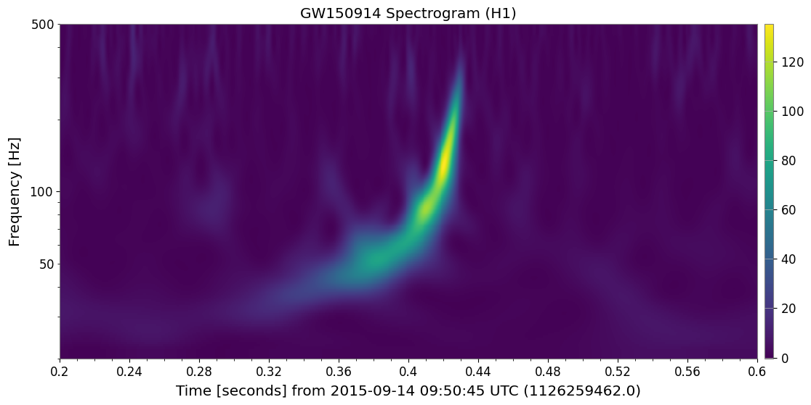
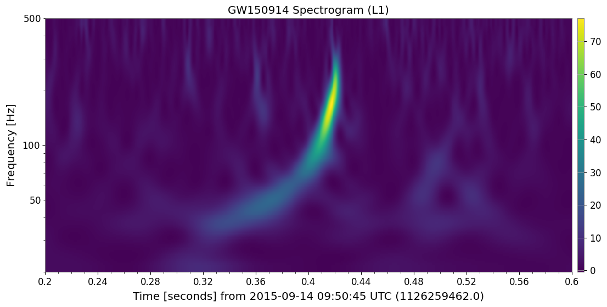
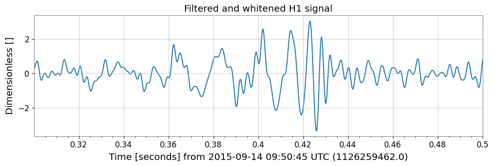
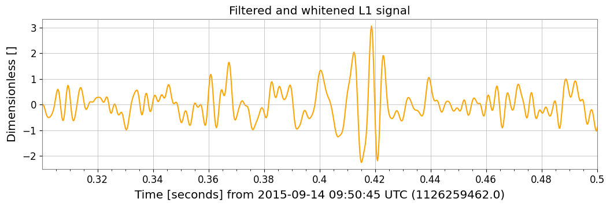

# Gravitational-Wave Signal Analysis (GW150914)

**A computational physics project analyzing open data from the LIGO Open Science Center to reconstruct the chirp signal of the first binary black hole merger.**


## Overview

This project performs time-domain and frequency-domain signal processing on strain data from the Hanford (H1) and Livingston (L1) detectors. It focuses on the event **GW150914**, applying spectral whitening and bandpass filtering to reveal the characteristic "chirp" signal buried in detector noise.

## Key Features

* **Data Retrieval:** Fetches open strain data directly using the `gwosc` and `gwpy` libraries.
* **Signal Processing:**
    * **Spectral Whitening:** Normalizes the data by the noise power spectral density (PSD).
    * **Bandpass Filtering:** Applies a 35–350 Hz filter to isolate the inspiral and merger frequencies.
* **Time-Frequency Analysis:** Generates Q-transform spectrograms to visualize the signal's frequency evolution.
* **Validation:** Reconstructs the signal waveform to match published LIGO figures.

## Project Contents

| File | Description |
| :--- | :--- |
| `notebooks/GW150914_Analysis.ipynb` | The complete Python code for data fetching, filtering, and plotting. |
| `presentation/GW150914_Slides.pdf` | A 10-slide LaTeX Beamer presentation summarizing the methodology and physics results. |

## Installation

1. Clone the repository:
   ```bash
   git clone [https://github.com/abdelrahman-26/gw150914-analysis.git](https://github.com/abdelrahman-26/gw150914-analysis.git)
   ```

2. Install the required libraries:
   ```bash
   pip install numpy scipy matplotlib gwpy gwosc astropy
   ```

## Usage
Run the Jupyter Notebook to reproduce the analysis:
  ```bash
     jupyter notebook notebooks/GW150914_Analysis.ipynb
  ```

## Results

The processing pipeline successfully extracted the gravitational wave signal from the background noise in both the Hanford and Livingston detectors.

### 1. Time-Frequency Analysis (Spectrograms)
The Q-transform reveals the characteristic "chirp" signal, a sharp increase in frequency and amplitude at the moment of merger, visible in both locations.

**Hanford (H1)**


**Livingston (L1)**


### 2. Reconstructed Waveforms
After applying whitening and a 35-350 Hz bandpass filter, the strain signals from both detectors clearly show the inspiral, merger, and ringdown phases characteristic of a binary black hole coalescence.

**Hanford (H1)**


**Livingston (L1)**


## License
Distributed under the MIT License. See `LICENSE` for more information.

## Acknowledgments
Data provided by the [LIGO Open Science Center]([https://www.google.com](https://gwosc.org/)).
